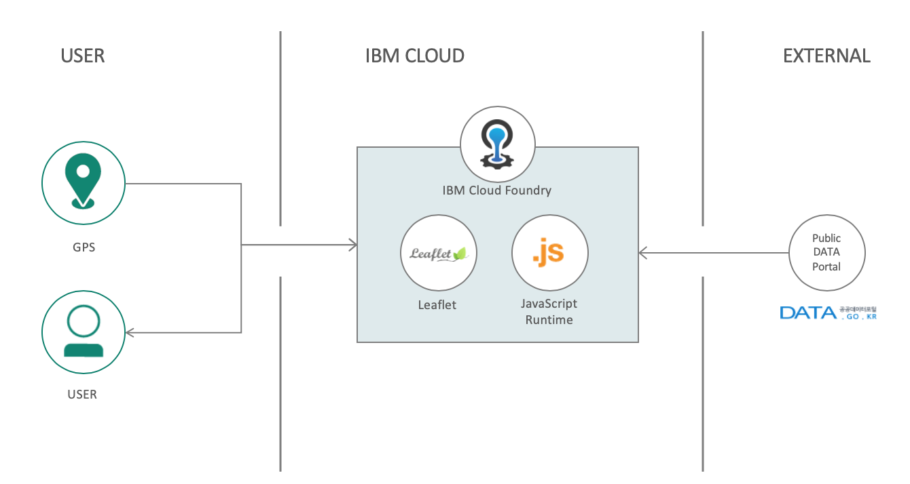
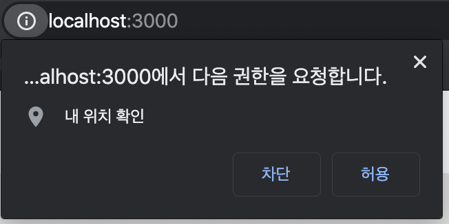
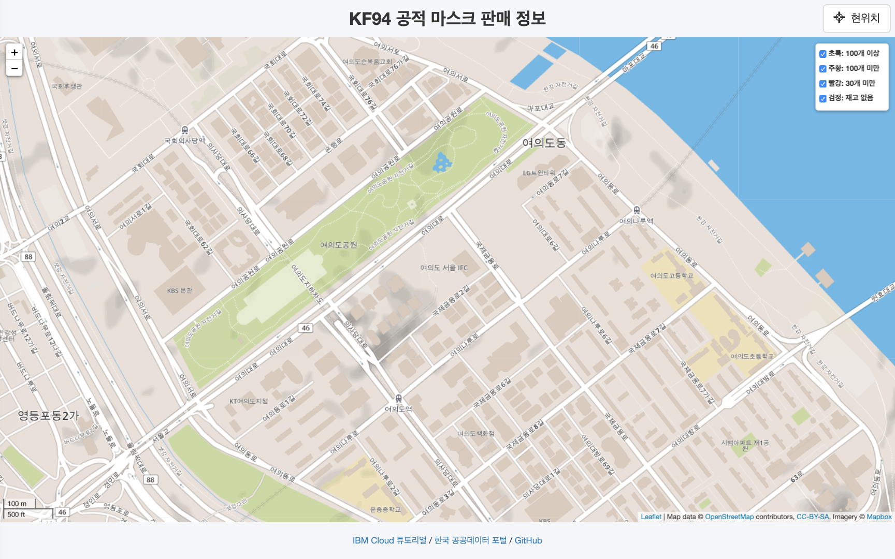
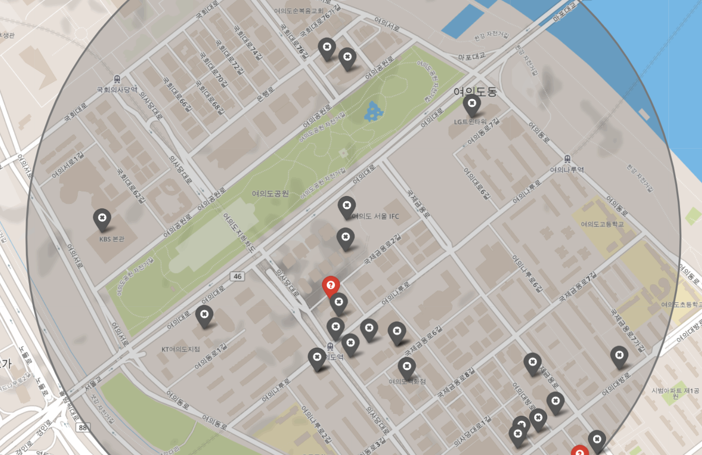
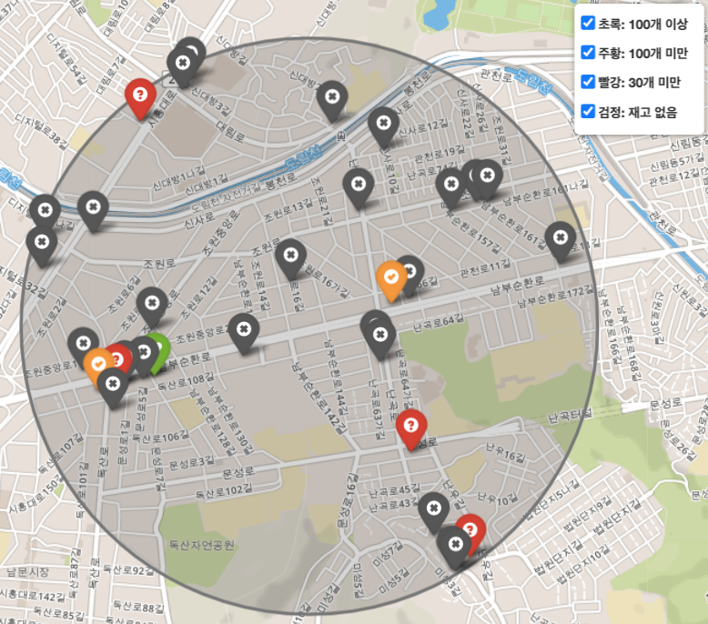
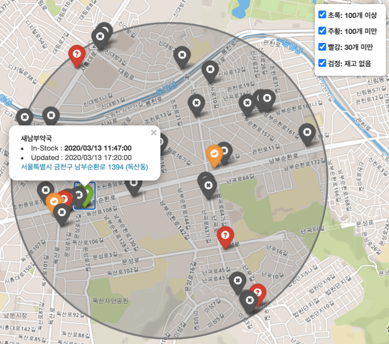
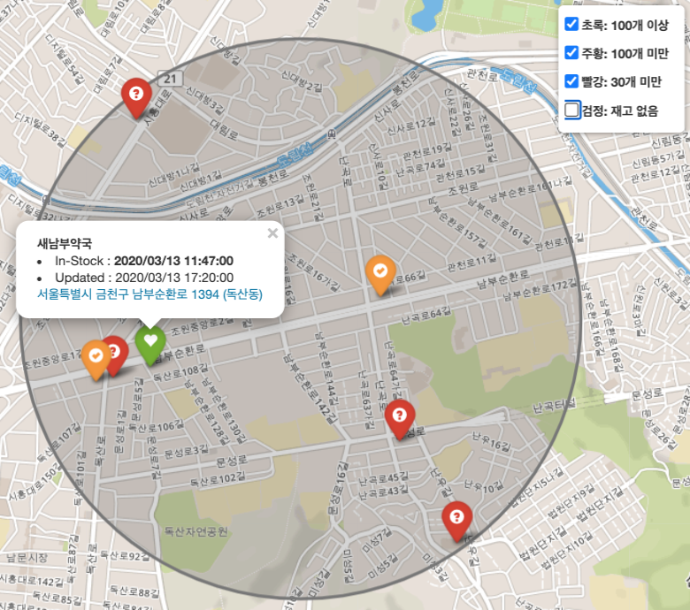

# KF94 Mask Map

*Read this in other languages: [한국어](README.md).*

This application shows the number of stock of KF94 masks near you by using web browser and GPS in South Korea. It is running on Node.js runtime and served on IBM Cloud. It works as web application so that you can get the masks with this application easily without any addition installation of application on your smart phone. It is very simple but straight forward to get the information you need.

You can try build and deploy this application on IBM Cloud with resources free of charge. The resources are limited but enough to serve this application. Check [IBM Cloud Lite Account](https://www.ibm.com/kr-ko/cloud/lite-account) for more information.

## Demo

You can see the demo application at this URL below.

* https://kf94maskmap.au-syd.cf.appdomain.cloud/

## Architecture



## Prerequisites

* IBM Cloud Account (https://cloud.ibm.com/registration)
* IBM Cloud CLI (https://cloud.ibm.com/docs/cli/reference/ibmcloud?topic=cloud-cli-install-ibmcloud-cli)
* Git SCM (https://git-scm.com/downloads)
* Node.js Runtime (https://nodejs.org/ko/download/)

## Step 1: Clone the application source code

Run the command line console or git bash shell. Next, clone the project with command below.

``` bash
git clone https://github.com/hongjsk/kf94maskmap.git
```

## Step 2: Run the application on your PC

If it is successfully cloned on your PC, you can see the `kf94maskmap` directory under your current directory. Let's navigate to the project directory and install the required packages.

### Navigate directory

``` bash
cd kf94maskmap
```

### Install the packages

``` bash
npm install
```

### Run the application

``` bash
npm start
```

### Check the app in your web browser

Check if the app is going well on this http://localhost:3000 URL.



When you click the `Allow` button, you can see the map with your current GPS location.



And the click any location on the map with your mouse. The application shows markers that indicated stock status of the masks around 1km from you pointed location. The color of marker means number of masks in stock as below.



* Green means over 100
* Orange means 30~100
* Red is under 30
* Black is out of stock



When you click the marker on the map, the dialog will be displayed that contains the information about the number of stock, time of in-stock, last updated time, store name and its address.



Of course, you can filter the markers by selecting options in the legend layer box on the right top corner of screen.



## Step 3: Ready to deploy the application

You might saw the application went well on your PC. Now let get ready to deploy it to the real world through IBM Cloud. This application can be deployed IBM Cloud Foundry Platform. Of course it can be deployed to either IBM Kubernetes Cluster or OpenShift Cluster too. But not this time. For beginners, Cloud Foudry is easier than those platforms.

Now open the `manifest.yml` file in the project directory with your favorite text editor.

``` yaml
---
applications:
 - name: kf94maskmap
   random-route: true
   memory: 64M
```

`kf94maskmap` is application's name and the route containing this name is randomly assigned. If you want to change the name, replace the `name` property's value with what you want.

## Step 4: Deploy the application

Now, we are going to take the first step towards the cloud journey.

### Login to IBM Cloud

In the command line terminal, login to IBM Cloud.

``` bash
ibmcloud login
```

**Note.** If you are using the federation account, you should add `--sso` option to get the one-time password token from your web browser.

``` bash
ibmcloud login --sso
```

### Select Cloud Foundry Organization

``` bash
ibmcloud target --cf
```

If you don't have any Cloud Foundry Organization or Workspace, please login IBM Cloud Dash board in your web browser.

* Select `Manage` > `Account` in the menu on top right of the screen
* Step into the `Account resource > Cloud Foundry orgs`
* Click the `Create` button

If you have already the Organization then just click the organization link to enter the `Spaces`. Otherwise, just click `Add a space` button.

Please check [this](https://cloud.ibm.com/docs/account?topic=account-orgsspacesusers)  for more information.

### Deploy Cloud Foundry Application

Deploy the application in `kf94maskmap` directory you worked in command line console.

``` bash
ibmcloud cf push
```

You can see the output messages similar to below if it is processing deployment correctly.

``` bash
% ibmcloud cf push
'cf push' 호출 중...

Manifest에서 hongjsk(으)로 hongjsk 조직/dev 영역에 푸시 중...
Manifest 파일 /Volumes/Works/Project/kf94maskmap/manifest.yml 사용
앱 정보를 가져오는 중...
이러한 속성의 앱 작성 중...
+ 이름:     kf94maskmap
  경로:     /Volumes/Works/Project/kf94maskmap
+ 메모리:   64M
  라우트:
+   kf94maskmap-boring-topi.au-syd.mybluemix.net

kf94maskmap 앱 작성 중...
라우트 맵핑 중...
로컬 파일을 원격 캐시와 비교 중...
Packaging files to upload...
파일 업로드 중...
 128.76 KiB / 128.76 KiB [===============================================================================================================================================] 100.00% 3s

API의 파일 처리가 완료되기를 기다리는 중...

앱 스테이징 및 로그 추적 중...
   Downloading sdk-for-nodejs_v4_2-20200227-1649...
   Downloading staticfile_buildpack...
   Downloading dotnet-core...
   Downloading liberty-for-java...

...

앱이 시작되기를 기다리는 중...

이름:                  kf94maskmap
요청된 상태:           started
라우트:                kf94maskmap-boring-topi.au-syd.mybluemix.net
마지막으로 업로드함:   Fri 13 Mar 01:10:32 KST 2020
스택:                  cflinuxfs3
빌드팩:                sdk-for-nodejs

유형:          web
인스턴스:      1/1
메모리 사용:   64M
시작 명령:     npm start
     상태      이후                   CPU    메모리       디스크    세부사항
#0   실행 중   2020-03-12T16:10:52Z   0.0%   40K / 64M   8K / 1G   

```

### Verify the application deployment

You can get the list of applications you deployed with command below.

``` bash
ibmcloud cf apps
```

then, the status of application is showing.

``` bash
% ibmcloud cf apps                                    
'cf apps' 호출 중...

hongjsk(으)로 hongjsk 조직/dev 영역의 앱 가져오는 중...
확인

이름                      요청된 상태   인스턴스   메모리   디스크   URL
kf94maskmap               started       2/2        64M      1G       kf94maskmap-boring-topi.au-syd.mybluemix.net
```

## Step 5: Verify the application is running

Finally, You can go to the route URL of you deployed application in web browser. Check the application if it works you expected or not.

# References

* [IBM Cloud Tutorials](https://cloud.ibm.com/docs/tutorials)
* [Korea Public Data Portal Open API for KF94 Mask API](https://www.data.go.kr/dataset/15043025/openapi.do)
* [Node.js](https://nodejs.org/) : Open source JavaScript runtime environment for the back side
* [Express](https://expressjs.com/) : JavaScript web framework for web server or API services
* [jQuery]() : JavaScript library to manipulate HTML DOM or handle the events
* [Leaflet](https://leafletjs.com/) : Open source library for mapping on the web
* [Leaflet Awesome-markers](https://github.com/lvoogdt/Leaflet.awesome-markers) : Leaflet extension for customizable marker
* [Twitter Bootstrap](https://getbootstrap.com/)


# License

This code pattern is licensed under the Apache Software License, Version 2. Separate third party code objects invoked within this code pattern are licensed by their respective providers pursuant to their own separate licenses. Contributions are subject to the Developer Certificate of Origin, Version 1.1 (DCO) and the Apache Software License, Version 2.

Apache Software License (ASL) FAQ
